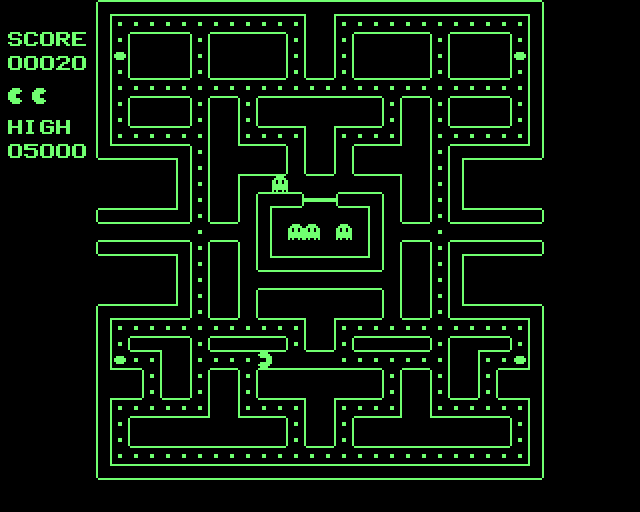

# NSPacMan

A Pac-Man–style arcade game for the **NorthStar Advantage** (1982) — written
from scratch in Z80 assembly.



It boots bare-metal from the Advantage's stock boot PROM — no CP/M, no DOS —
and runs identically on the [NorthMac](https://github.com/davetroy/NorthMac)
emulator and on real hardware, loaded from a USB stick via a Gotek floppy
emulator. The whole game is **under 6 KB**: it fits, with its loader, in the
first two tracks of one hard-sectored floppy — and it saves its high-score
table back to that same floppy.

## Features

- The classic 28×31 maze (240 dots, 4 power pills) rendered as thin
  arcade-style outline walls, context-derived from the maze data
- Horizontally doubled 16×8 sprites and tiles — on the Advantage's tall
  CRT pixels this lands almost exactly on arcade proportions
- Four ghosts with staged house release, chase AI with per-ghost
  personality, frightened mode, and chain scoring (200/400/800/1600 shown
  frozen at the meal spot, arcade-style)
- Flashing power pills, chomping animation, collapse-and-pop death sequence
- Sound on the Advantage's 1-bit speaker: intro fanfare, waka-waka,
  power-pill sweep, rising ghost-eat zip, death warble with final bleep-bleep
  (all original renditions in the arcade spirit)
- SCORE and HIGH panel and lives in an arcade-style 8×8 font
- Bonus life at 10,000 points; a musical intermission plays after every
  second maze cleared
- **Attract mode**: title screen with a ghost parade alternating with the
  top-10 table; any key starts a game
- **High scores**: a qualifying score prompts for three typed initials.
  The top-10 table is written back to the floppy (track 4, sector 5 — an
  otherwise-empty track, two guard tracks away from any code) using
  the technical manual's §3.7.7 write protocol, so scores survive power-off —
  on real hardware the Gotek persists them into the HFE on the USB stick.
  On a write-protected disk scores simply live in RAM until power-off.
- Steering: **WASD**, **IJKL**, keypad **8/4/6/2**, or the keypad arrow keys
  (`^H ^J ^K ^L` control codes); **ESC** restarts mid-game

## Building

Requires [z80asm](https://www.nongnu.org/z80asm/) (`brew install z80asm`)
and Python 3.

```
./build.sh          # -> pacman.nsi (NorthStar sector image)
./build.sh hfe      # -> pacman.hfe (Gotek/HxC HFEv3, needs greaseweazle)
```

Run it in [NorthMac](https://github.com/davetroy/NorthMac):

```
northmac pacman.nsi     # press RETURN at LOAD SYSTEM
```

## Running on real hardware

The Advantage uses **hard-sectored** floppies (ten sector holes plus an
index hole; sector identity is purely positional), which rules out ordinary
floppy-emulator images. The path that works:

1. A Gotek running **HxC firmware** (hard-sector support), S0 jumper only
2. Disk images in **HFEv3** (`SETINDEX` opcodes carry the sector pulses) —
   `build.sh hfe` produces one via greaseweazle's native North Star codec
3. Name it `DSKA0000.HFE` (indexed mode) on the USB stick, boot, press RETURN

The two-stage loader talks to the Advantage's floppy controller using a
protocol reverse-engineered from the boot PROM and a working CP/M loader,
honoring several behaviors of the real silicon that no emulator modeled:
the I/O-control register's bit 4 must stay set, the motor timer needs
periodic command-5 events, an acquire delivers sector STAT2+1, and the
sector-number register must never be read mid-stream. The high-score save
follows the manual's write protocol: find the prior sector, catch the
sector-mark edge, arm the write flag within 150 µs, then stream preamble,
sync bytes, 512 data bytes, and a software CRC. The full contract is
documented in the NorthMac project.

`test/run_full.c` is a headless full-system harness: it boots the actual
disk image through the loader against a faithful floppy-controller model
(including hardware-correct sector writes), injects scripted keystrokes,
and can cold-boot a second time to prove the high-score table persisted.

## Provenance

Inspired by Hans Hübner's
[Advantage resurrection](https://netzhansa.com/debugging-northstar-advantage/),
in which he concluded that "the NorthStar Advantage never had a chance to
shine as a gaming system until now." This is an independent take on the same
idea: the game, its graphics, and its sounds were written from scratch (with
Claude Code as the co-author) in one long day, on a boot-and-graphics
foundation built while porting the GREENFIELD generative-art demo to real
hardware.

PAC-MAN is a trademark of Bandai Namco Entertainment. This is an unaffiliated
fan homage with original code, art, and audio, built for the joy of seeing a
1982 business machine finally get to play.
